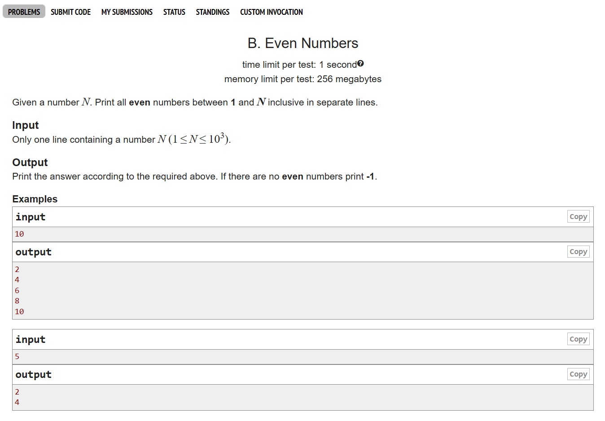
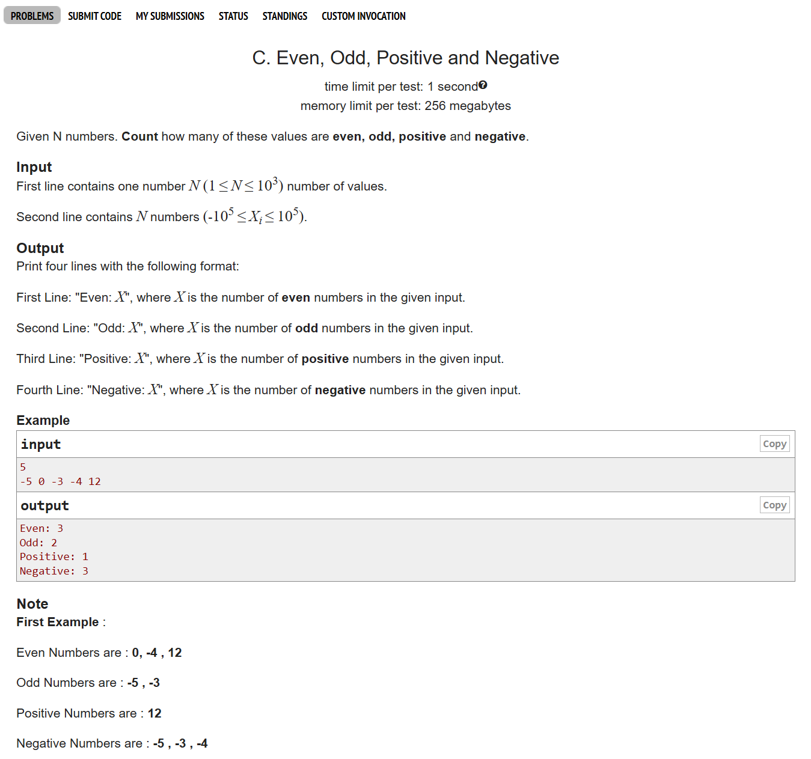
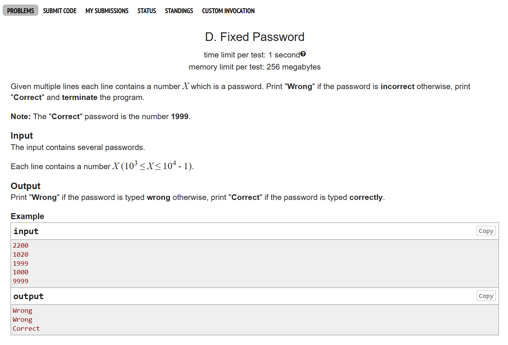

# Date: 13 April, 2025 - Sunday

## Topics:
- Text Instructions: Module 6 [Must Read]
0. Introduction
1. Increment Decrement operator
2. Pre and post increment
3. Even Numbers
4. Even odd pos neg I
5. Even odd pos neg II
6. Fixed Password
7. Finding maximum value Animated
8. Max and Min
9. Multiplication Table
10. Digits
11. Nested loop Animated
12. Nested loop
13. Summary
- Quiz: Module 06
- Practice Extra Problem and Quiz Explanation Module 06
- Feedback Form Module 06

## Text Instructions: Module 6 [Must Read]
- [মডিউলের প্রবলেম লিংক-](https://docs.google.com/document/d/1NDdqTi6fvbM2AZxl8B17XKizAMo2EkbXKOqC5-SXI9o/edit?usp=sharing)
- মডিউল রিলেটেড তোমার যে কোন ফিডব্যাক থাকলে এই ফর্মে লিখে দিতে পারো। আমরা তোমার ফিডব্যাক গুরুত্বসহকার দেখব।
- [Feedback Form Link](https://forms.gle/DH5mjuGD1x2EZ4z29)

## 0. Introduction
- Problem solving with Loop
- One more clear to `increment` and `decrement operator`
    - Have two variation:
        - `Pre increment/decrement`
        - `Post increment/decrement`
- The clear concept of `Nested Loop`

## 1. Increment Decrement operator
- Increment shortcut
    - `i++` = `i = i + 1` It's only can increment 1
    - `i+=1` = `i = i + 1`
    - `i+=2` = `i = i + 2`
    - `i+=3` = `i = i + 3`
      
    - `i*=3` = `i = i * 3`
    - `i/=3` = `i = i / 3`

## 2. Pre and post increment
- Pre increment `++i`
- Post increment `i++`
- Program: `pre_post.c`
- `Build Logic`: Program thinking then see the output

## 3. Even Numbers
- 
- Program: `problem_1.c`
- Explanation problem one (1)
- You can easily handle input and output without repeat checking with this two step:
    - `Step 1`: Search to google `competitive companion` Go to `Chrome Web Store` and add to this extension in your web browser and pinned.
    - `Step 2`: Go to your VSCode and go to extension. Here search to `cph (Competitive Programming H)` and install.

    - Go to problems in the web browser and click to `competitive companion extension` and then back to vscode and set the compiler which you will try.

## 4. Even odd pos neg I
- 
- Program: `problem_2.c`
- Explanation problem two (2)

## 5. Even odd pos neg II
- Part I had done 50% code
- And part II have done 50%. Then == 100%

## 6. Fixed Password
- 
- Program: `problem_3.c`
- Explanation problem three (3)

## 7. Finding maximum value Animated
- Check every value and find the maximum value
- It's a example video.

## 8. Max and Min
- xyz

## 9. Multiplication Table
- xyz

## 10. Digits
- xyz

## 11. Nested loop Animated
- xyz

## 12. Nested loop
- xyz

## 13. Summary
- xyz

## Quiz: Module 06
- xyz

## Practice Extra Problem and Quiz Explanation Module 06
- xyz

## Feedback Form Module 06
- xyz